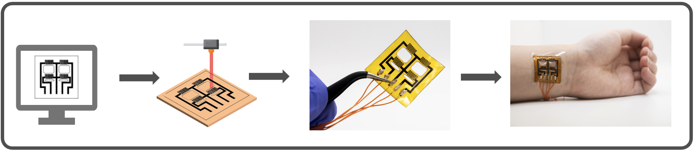
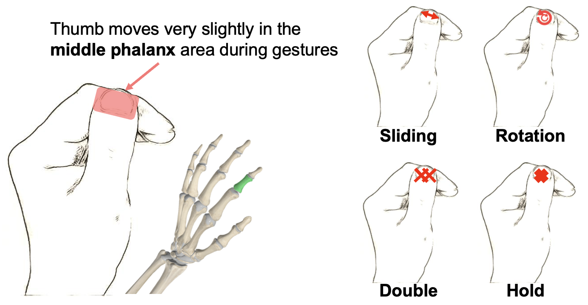
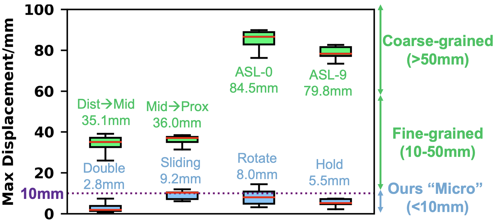
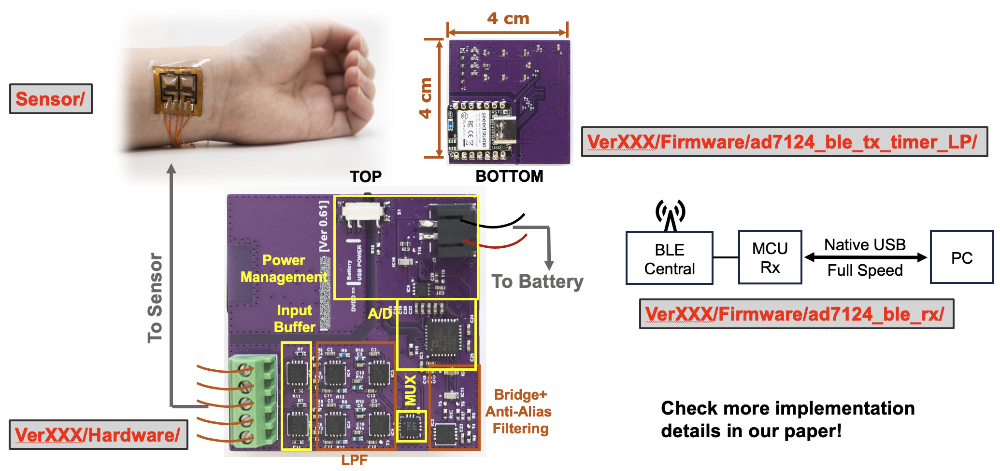
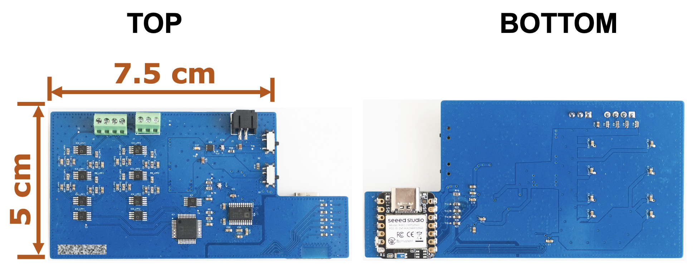
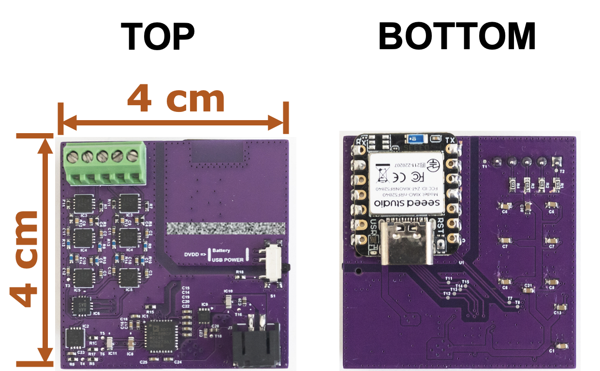

# WISP (Wearable Imperceptible Sensing Platform)
<p align="center">
  
</p>

<p align="center">
  
  <!-- <span style="display:inline-block; width:20px;"></span> -->
  
</p>


<h3 align="center">
  <a href="https://dl.acm.org/doi/10.1145/3774906.3800486">
    [ACM SenSys'26] WISP: Printable Graphene-Based Wearables for Force-Based Micro-Gesture Recognition
  </a>
</h3>

<p align="center">
  <a href="LICENSE"></a>
</p>

***WISP*** provides a printable solution based on Laser-Induced Graphene (LIG) technology for **mm-scale micro-gesture recognition**, enabling discrete and unobtrusive interaction with smart devices. It translates tiny wrist deformations into piezoresistive changes, which are then digitized and streamed. In this repository, we open-source the sensing stack of WISP, including the sensor design, hardware, and firmware, featuring a **multi-channel** (2x2, extendable), **real-world-robust**, **high-sensitivity**, **low-noise** (100 uVpp), **low-power** (10 mW), and **compact** (4x4 cm) design. We hope this repository encourages further community involvement to improve and expand this area.

## Why WISP?
- Captures SOTA-level micro-gestures from extremely small force-based displacements, as demonstrated in multi-user, real-world studies and benchmarks.
- Provides a printable alternative to current gesture-recognition methods (e.g. EMG and accelerometers).
- Pushes LIG toward thinner substrates and helps bring it from the lab to the field.
- Offers an open-source multi-channel, low-noise, and low-power solution that can be extended to diverse piezoresistive sensors in a smartwatch-sized form factor.

## Get Started
### How It Works

<p align="left">
  
</p>

- [`Sensor/`](./Sensor/) includes our sensor-array design pattern for laser cutting on 25-um Polyimide (PI).
- Sensor post-processing improves robustness, signal decoupling, and connectivity (see the paper for details).
- [`Ver061/Hardware/`](./Ver061/Hardware/) includes the PCB design files and documentation. It performs analog signal conditioning, multiplexing, A/D conversion, and wireless data transmission to the host. Version 0.60 ([`Ver060/Hardware/`](./Ver060/Hardware/)) is also provided in the same format as a reference, featuring iron-solderability and better noise performance yet a double larger form factor. A comparison between Version 0.60 and 0.61 is provided in the [Version Comparison](#version-comparison) section below. You need to generate your own Gerber/NC drill files for fabrication.
- [`Ver061/Firmware/`](./Ver061/Firmware/) includes the firmware for nRF52840 modules (Seeed XIAO nRF52840). Both peripheral (Tx) and central (Rx) nodes are provided. Tx controls ADC/MUX/BLE timing and configuration, reads the measurements via high-speed SPI, and then packs and sends the data to Rx over BLE. A PC host can read the measurements in real time through USB. The firmware is designed to be compatible with Arduino. As with the hardware, the firmware for Ver 0.60 ([`Ver060/Firmware/`](./Ver060/Firmware/)) is also provided in the same format.

We worked hard to clean up and refactor the design and codebase, trying to make everything as simple as possible to follow. All implementations have been verified and tested by human experts on real devices. We hope this repository is useful to the community.

</details>

<details>
<summary><strong>Directory Structure</strong></summary>

```
.
├── .gitignore            
├── LICENSE                                     # MIT license                          
├── License_Driver                              # License files of the external libraries used in this repo
│   ├── LICENSE_ADAFRUIT_MIT.txt
│   └── LICENSE_ADI_BSD.txt
├── README_assets
│   ├── FabPipeline.png
│   ├── Function.png
│   ├── Gesture.png
│   └── Granularity.png
├── README.md                                    
├── Sensor
│   └── 2x2-array.pdf                            # 2×2 sensor array design reference.
├── Ver060
│   ├── Firmware
│   │   ├── ad7124_ble_rx
│   │   │   └── ad7124_ble_rx.ino                # BLE receiver sketch that forwards incoming data to USB serial.
│   │   └── ad7124_ble_tx_timer_LP
│   │       ├── ad7124_ble_tx_timer_LP.ino       # Main BLE transmitter sketch for timed sensing and packet streaming.
│   │       ├── ad7124_regs.c                    # AD7124 default register values used at startup.
│   │       ├── ad7124_regs.h                    # AD7124 register table declaration.
│   │       ├── AD7124.cpp                       # Low-level AD7124 SPI driver implementation.
│   │       ├── AD7124.h                         # Low-level AD7124 driver declarations and macros.
│   │       ├── adg726.cpp                       # External analog mux control for the Ver0.60 hardware path.
│   │       ├── adg726.h                         # External analog mux control declarations for Ver0.60.
│   │       ├── CN0391.cpp                       # Sensor readout helper implementation built on the AD7124 path.
│   │       ├── CN0391.h                         # Sensor readout helper declarations.
│   │       ├── Communication.cpp                # Minimal SPI transfer helpers shared by the firmware.
│   │       ├── Communication.h                  # Shared SPI helper declarations and pin definitions.
│   │       └── PROGMEM_readAnything.h           # Small utility templates for reading typed data from program memory.
│   └── Hardware
│       ├── ver060.Annotation                    # Hardware annotation metadata for Ver0.60.
│       ├── ver060.PDF                           # Exported hardware reference document for Ver0.60.
│       ├── ver060.PcbDoc                        # PCB layout source for Ver0.60.
│       ├── ver060.stackup                       # PCB layer stack definition for Ver0.60.
│       ├── ver060_ADC.SchDoc                    # ADC section schematic for Ver0.60.
│       ├── ver060_LPF.SchDoc                    # Low-pass filter schematic for Ver0.60.
│       ├── ver060_MCU.SchDoc                    # MCU section schematic for Ver0.60.
│       ├── ver060_Overview.SchDoc               # Top-level schematic overview for Ver0.60.
│       ├── ver060_Power.SchDoc                  # Power section schematic for Ver0.60.
│       └── ver060_SignalAnalog.SchDoc           # Analog signal path schematic for Ver0.60.
└── Ver061
    ├── Firmware
    │   ├── ad7124_ble_rx
    │   │   └── ad7124_ble_rx.ino                # BLE receiver sketch that forwards incoming data to USB serial.
    │   └── ad7124_ble_tx_timer_LP
    │       ├── ad7124_ble_tx_timer_LP.ino       # Main BLE transmitter sketch for timed sensing and packet streaming.
    │       ├── ad7124_regs.c                    # AD7124 default register values used at startup.
    │       ├── ad7124_regs.h                    # AD7124 register table declaration.
    │       ├── AD7124.cpp                       # Low-level AD7124 SPI driver implementation.
    │       ├── AD7124.h                         # Low-level AD7124 driver declarations and macros.
    │       ├── adg726.cpp                       # Alternative analog mux control implementation kept alongside Ver0.61.
    │       ├── adg726.h                         # Alternative analog mux control declarations kept alongside Ver0.61.
    │       ├── CN0391.cpp                       # Sensor readout helper implementation built on the AD7124 path.
    │       ├── CN0391.h                         # Sensor readout helper declarations.
    │       ├── Communication.cpp                # Minimal SPI transfer helpers shared by the firmware.
    │       ├── Communication.h                  # Shared SPI helper declarations and pin definitions.
    │       ├── max4734.cpp                      # Active analog switch control for the Ver0.61 hardware path.
    │       ├── max4734.h                        # Active analog switch control declarations for Ver0.61.
    │       └── PROGMEM_readAnything.h           # Small utility templates for reading typed data from program memory.
    └── Hardware
        ├── ver061.Annotation                    # Hardware annotation metadata for Ver0.61.
        ├── ver061.PDF                           # Exported hardware reference document for Ver0.61.
        ├── ver061.PcbDoc                        # PCB layout source for Ver0.61.
        ├── ver061.stackup                       # PCB layer stack definition for Ver0.61.
        ├── ver061_ADC.SchDoc                    # ADC section schematic for Ver0.61.
        ├── ver061_LPF.SchDoc                    # Low-pass filter schematic for Ver0.61.
        ├── ver061_MCU.SchDoc                    # MCU section schematic for Ver0.61.
        ├── ver061_Overview.SchDoc               # Top-level schematic overview for Ver0.61.
        ├── ver061_Power.SchDoc                  # Power section schematic for Ver0.61.
        └── ver061_SignalAnalog.SchDoc           # Analog signal path schematic for Ver0.61.

```
</details>

### Setup
- macOS 15.6 on a 14-inch MacBook Pro with M1 Pro
- Arduino 2.3
- Seeed nRF52 Boards library 1.1.4 (BLE SoftDevice S140 7.3.0)
- Altium Designer 26
- Python >= 3.10
- 0.05% precision resistors for critical locations
- The DVDD port of the MCU can be connected to either USB or battery power through a switch. During firmware upload or data logging via USB, connect DVDD to USB power. During normal data logging via BLE, connect DVDD to the battery. Connecting DVDD to the battery while USB is also connected can be dangerous or noisy without protection circuits.


### Version Comparison
<table border="1" width="75%">
  <tr>
    <td align="left" width="20%">
    </td>
    <td align="center" width="40%">
        <br>
        <strong>Ver0.60</strong><br>
    </td>
    <td align="center" width="40%">
        <br>
        <strong>Ver0.61</strong><br>
    </td>
  </tr>

  <tr>
    <td align="left" width="20%">
        <strong>Noise Range <sup>[1]</sup></strong><br>
    </td>
    <td align="center" width="40%">
        50-200 uVpp
    </td>
    <td align="center" width="40%">
        100-350 uVpp
    </td>
  </tr>

  <tr>
    <td align="left" width="20%">
        <strong>Iron-Solderability</strong><br>
    </td>
    <td align="center" width="40%">
        Yes
    </td>
    <td align="center" width="40%">
        Possible but not easy (space is limited)
    </td>
  </tr>

  <tr>
    <td align="left" width="20%">
        <strong>Dimension</strong><br>
    </td>
    <td align="center" width="40%">
        5 cm x 7.5 cm (mostly 0603 components)
    </td>
    <td align="center" width="40%">
        4 cm x 4 cm (mostly 0402 components)
    </td>
  </tr>
</table>
<sub>[1] The noise performance is measured end-to-end, which can be influenced by several elements: sensor fabrication, environment noise/interference (powerline, RFI, etc), human body posture/orientation, sensor attachment condition, length and material of wires, soldering quality, component quality/precision, and so on.</sub>


## Future Improvement
### Towards Version 0.62
Ver 0.62 targets noise performance as good as Ver 0.60 (50 uVpp) with a form factor as small as Ver 0.61 (4 cm x 4 cm). The main improvements will be in PCB layout and firmware timing. This includes, but is not limited to:
- More clearance between the board edge and the analog components.
- Reshaping the copper pour and removing unnecessary regions.
- Improving via usage for grounding, return paths, and fencing.
- Stricter star-connected power routing.
- Adding small resistors between the two X2Y capacitors to dampen anti-resonance.
- Better power decoupling.
- More precise MCU timing using timer-based interrupts (the timer currently somehow conflicts with the BLE, so it is disabled).

If you have any thoughts on how to improve performance, please do not hesitate to share them with us!

## Citation
If you use this repository, we appreciate your starring this repo and citing the paper below

```
Zhenyu Lei, Xiaomeng Liu, Quan Zhang, VP Nguyen, Jun Yao, and Deepak Ganesan. 2026. WISP: Printable Graphene-Based Wearables for Force-Based Micro-Gesture Recognition. In Proceedings of the 2026 ACM/IEEE International Conference on Embedded Artificial Intelligence and Sensing Systems (SenSys '26). Association for Computing Machinery, New York, NY, USA, 531–544. https://doi.org/10.1145/3774906.3800486
```

## License
MIT © Zhenyu Lei (zhenyulei@umass.edu)

## Acknowledgements
WISP is built on top of the open-source drivers from Analog Device Inc. and Adafruit Inc. The original licenses and copyright notices for these drivers are preserved in [`License_Driver/`](./License_Driver/).
